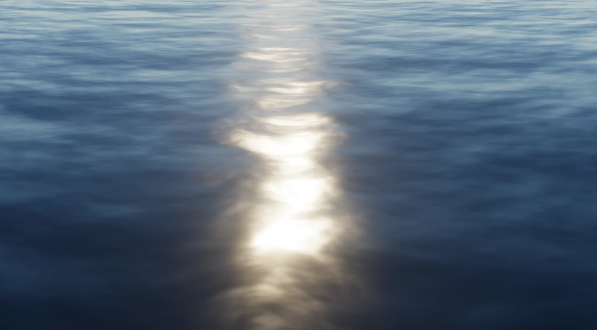

# Bevy Simple Water

[](https://github.com/GuillaumeDelorme/bevy_simple_water#license)
[](https://crates.io/crates/bevy_simple_water)
[](https://crates.io/crates/bevy_simple_water)
[](https://docs.rs/bevy_simple_water/latest/bevy_simple_water/)

`bevy_simple_water` is a small Bevy plugin for adding animated water material to a mesh.



## Requirements

The water material shader uses deferred rendering, so your app needs:

```rust,ignore
.insert_resource(DefaultOpaqueRendererMethod::deferred())
```

Any camera that should render the water also needs these prepass components:

```rust,ignore
DeferredPrepass,
DepthPrepass,
MotionVectorPrepass,
```

Screen-space reflections are optional, but they help if you want stronger reflections. The `basic` example shows a full scene setup.

## Basic use

```rust,ignore
use bevy::{
    core_pipeline::prepass::{DeferredPrepass, DepthPrepass, MotionVectorPrepass},
    pbr::DefaultOpaqueRendererMethod,
    prelude::*,
};
use bevy_simple_water::{SimpleWaterPlugin, Water};

fn main() {
    App::new()
        .insert_resource(DefaultOpaqueRendererMethod::deferred())
        .add_plugins((DefaultPlugins, SimpleWaterPlugin))
        .add_systems(Startup, setup)
        .run();
}

fn setup(mut commands: Commands, mut meshes: ResMut<Assets<Mesh>>) {
    commands.spawn((
        Water::ocean(),
        Mesh3d(meshes.add(Plane3d::new(Vec3::Y, Vec2::splat(1.0)))),
        Transform::from_scale(Vec3::splat(100.0)),
    ));

    commands.spawn((
        DirectionalLight::default(),
        Transform::from_xyz(1.0, 1.0, 0.0).looking_at(Vec3::ZERO, Vec3::Y),
    ));

    commands.spawn((
        Camera3d::default(),
        Transform::from_xyz(-8.0, 6.0, 0.0).looking_at(Vec3::Y * 1.8, Vec3::Y),
        DeferredPrepass,
        DepthPrepass,
        MotionVectorPrepass,
    ));
}
```

## Presets

The crate includes a few built-in presets:

- `Water::ocean()`
- `Water::tropical()`
- `Water::lake()`
- `Water::river()`
- `Water::pond()`
- `Water::pool()`
- `Water::natural_pool()`
- `Water::swamp()`
- `Water::arctic()`

`Water::default()` is the same as `Water::ocean()`.

## Custom settings

If a preset gets you close, you can start there and override what you need:

```rust,ignore
Water {
    color: Color::srgb(0.02, 0.10, 0.12),
    perceptual_roughness: 0.05,
    octave_scales: Vec4::new(4.0, 8.0, 16.0, 28.0),
    ..Water::tropical()
}
```

The `Water` fields map directly to the shader settings:

- `color` sets the base color.
- `perceptual_roughness` controls how sharp or soft reflections look.
- `octave_vectors` controls wave direction and speed.
- `octave_scales` controls wave size and frequency.
- `octave_strengths` controls how strong each octave is.

You can also change a `Water` component at runtime. The plugin updates the generated material in place.

## Examples

Run the example scene:

```sh
cargo run --example basic
```

Run the preset gallery:

```sh
cargo run --example presets
```

The `presets` example shows every built-in preset side by side and includes a simple free camera.

Run the realtime settings update demo:

```sh
cargo run --example realtime_settings
```

The `realtime_settings` example mutates `Water` every frame to show that color and wave settings are applied to the generated material in real time.

## Bevy support table

| bevy | bevy_simple_water |
|------|-------------------|
| 0.18 | 0.1               |

## Credit

The shader started from Bevy's SSR example and was adapted and expanded from there. The original shader is here:

<https://github.com/bevyengine/bevy/blob/v0.18.1/assets/shaders/water_material.wgsl>

## License

Licensed under either MIT or Apache-2.0, at your option. See `LICENSE-MIT` and `LICENSE-APACHE`.
